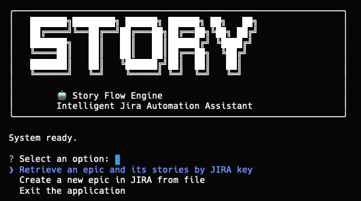

# Installation

## Prerequisites

- **Python 3.9+** — verify with `python --version`
- **Git** — for cloning the repository
- **A Jira account** with API access — you'll need an [API token](https://id.atlassian.com/manage-profile/security/api-tokens)

## Step-by-Step

### 1. Clone the repository

```bash
git clone <repo-url>
cd story-flow-engine
```

### 2. Create and activate a virtual environment

#### macOS / Linux

```bash
python -m venv .venv
source .venv/bin/activate
```

#### Windows

```bash
python -m venv .venv
.venv\Scripts\activate
```

### 3. Install dependencies

```bash
pip install -r requirements.txt
```

### 4. Configure environment

```bash
cp .env.example .env
```

Edit `.env` with your Jira credentials. See [Configuration](configuration.md) for details on each variable.

### 5. Verify the installation

```bash
./scripts/run-cli
```

You should see the Story Flow Engine welcome screen with an interactive menu.


If you see a `ModuleNotFoundError`, make sure your virtual environment is activated and dependencies are installed.

## Next Steps

- [Configure your Jira connection](configuration.md)
- [Learn the CLI commands](../guides/cli-reference.md)
- [Prepare your first Markdown epic](../guides/markdown-format.md)
